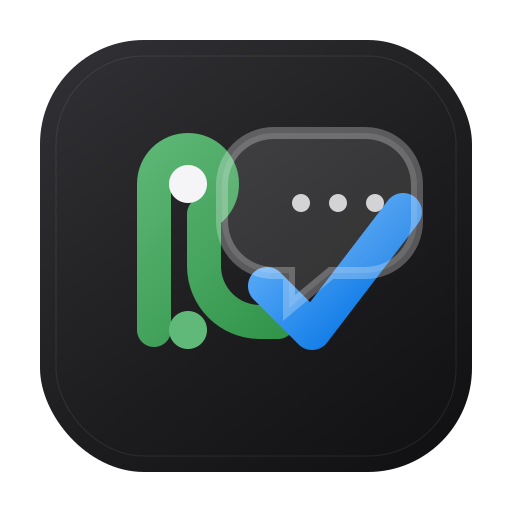
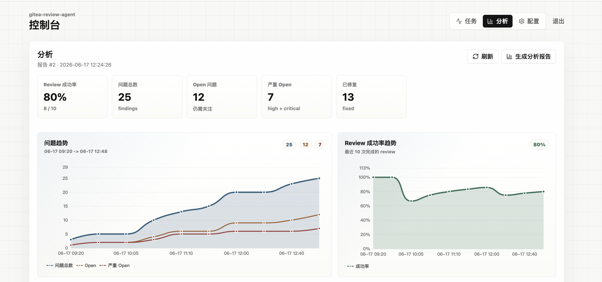
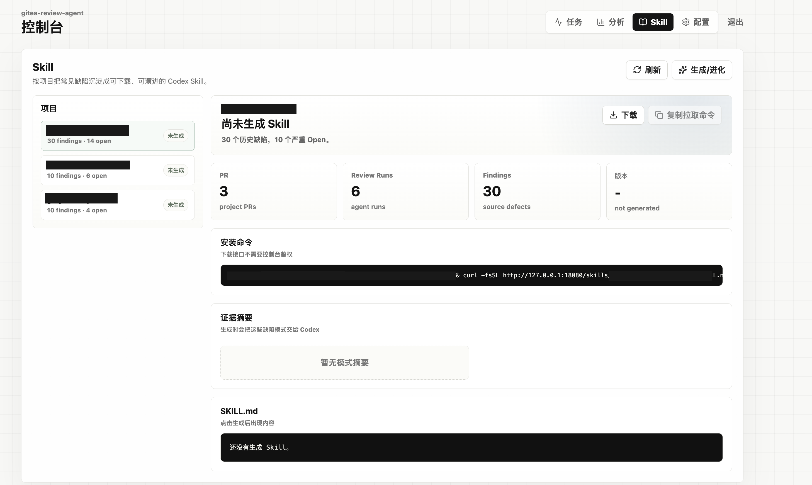

<p align="center">
  
</p>

<h1 align="center">gitea-review-agent</h1>

<p align="center">
  Self-hosted pull request review automation for Gitea.
</p>

<p align="center">
  <a href="https://liutianjie.github.io/gitea-review-agent/">Project site</a>
  ·
  <a href="#quick-start">Quick start</a>
  ·
  <a href="#configuration">Configuration</a>
</p>

gitea-review-agent receives Gitea pull request events through webhooks, prepares
a read-only checkout, runs a configured reviewer, and posts review findings back
to the PR. It can use Codex by default, and can also run Claude Code or a
MiniMax-compatible reviewer as separate review backends. MiniMax-compatible
runs reuse the Claude Code path and can be routed through cc-switch providers or
an Anthropic-compatible relay endpoint.

Reviews are stateful: follow-up pushes and `/review` comments can continue the
same reviewer session instead of starting from an empty context every time.

## Screenshots

<p align="center">
  
</p>

<p align="center">
  
</p>

## Features

- **Gitea PR review automation** — handles pull request, sync, and issue comment
  events from Gitea webhooks.
- **Pluggable reviewers** — Codex, Claude Code, and MiniMax-compatible reviewer
  backends can be configured independently.
- **cc-switch provider routing** — MiniMax-compatible reviews can reuse the
  Claude Code runner and switch provider through cc-switch before each run.
- **Read-only checkouts** — reviewer processes inspect the diff and do not run
  repository code.
- **Incremental git cache** — repositories are mirrored under `/cache`, then
  checked out into deterministic worktrees for each job.
- **Admin console** — `/admin` shows review jobs, logs, runtime configuration,
  analytics, and project rule exports.
- **Project rules** — each repository can expose a downloadable `SKILL.md` at
  `/skills/<owner>/<repo>/SKILL.md`.
- **Readiness endpoint** — `/healthz` is a liveness check; `/readyz` reports DB,
  configuration, queue counters, and latest failure context.

## How it works

```text
Gitea webhook
  -> verify HMAC
  -> enqueue job in SQLite
  -> fetch cached mirror + prepare worktree
  -> run configured reviewer
  -> map findings to diff lines
  -> publish review through Gitea API
```

## Reviewer backends

Codex is the default reviewer. Claude Code and MiniMax-compatible reviewers are
optional and keep their own reviewer identity, sessions, logs, and PR comments.

MiniMax-compatible review runs through the Claude Code execution path. There are
two supported ways to route it:

- **cc-switch provider** — set `MINIMAX_PROVIDER_ID` to switch Claude Code to a
  configured provider before the MiniMax review run.
- **Direct relay endpoint** — set `MINIMAX_API_KEY` and `MINIMAX_BASE_URL` for an
  Anthropic-compatible MiniMax or relay endpoint.

Example:

```bash
MINIMAX_ENABLED=true
MINIMAX_PROVIDER_ID=minimaxreview
# or:
MINIMAX_API_KEY=...
MINIMAX_BASE_URL=https://relay.example.com
```

The job is still stored and posted as the `minimax` reviewer, so it can be
tracked separately from Codex and Claude Code.

## Quick start

```bash
docker run --rm \
  -p 18080:8080 \
  -e ADMIN_PASSWORD=choose-a-strong-password \
  -e GITEA_URL=https://gitea.example.com \
  -e GITEA_TOKEN=... \
  ghcr.io/liutianjie/gitea-review-agent:latest
```

Then open `http://localhost:18080/admin`, finish the runtime configuration, and
add a Gitea webhook pointing to `http://<host>:8080/webhook`.

For local development or persistent data, use Docker Compose:

```bash
export ADMIN_PASSWORD=choose-a-strong-password
docker compose up -d
```

Persist these paths in production:

- `/data` — SQLite database
- `/cache` — bare git mirrors
- `/work` — temporary worktrees
- `/codex-home` — Codex auth and sessions
- `/claude-home` — Claude Code state
- `/cc-switch` — optional provider/proxy configuration

## Auth: authfile (default) vs apikey

| Mode | Cost | Setup |
|------|------|-------|
| `authfile` (default) | reuses your ChatGPT subscription, **no extra API billing** | run `codex login` locally, upload the resulting `~/.codex/auth.json` via the `/admin` console |
| `apikey` | **separately billed** OpenAI Platform tokens | set `CODEX_API_KEY` + `CODEX_AUTH_MODE=apikey` |

In `authfile` mode the `/codex-home` volume **must be writable** so codex can
refresh its OAuth token in place between runs. Use the console's "check auth
status" button to catch a stale token early.

## First-run checklist

1. **Codex creds**: `codex login` on your machine → upload `~/.codex/auth.json` at `/admin`.
2. **Gitea bot**: a Gitea user with a token scoped **repo read + PR write**; add it to private repos.
3. **Console password**: set `ADMIN_PASSWORD` (no password ⇒ `/admin` returns 503).
4. **Console config** (`/admin`): Gitea URL, bot token, webhook secret, model,
   trigger keywords, repo allowlist. DB settings override env and apply without a restart.
5. **Gitea webhook** (per repo or org-level):
   - URL `http://<host>:8080/webhook`, Content-Type `application/json`
   - Secret = the webhook secret you set in the console
   - Events: **Pull Request** + **Pull Request Sync** + **Issue Comment**
6. **Deployment check**: `/readyz` should return `{"ok":true,...}` after the
   first boot. If it returns 503, inspect `config_warnings` first.

## Usage

- Open a PR or push commits → automatic review.
- Comment `/review <question>` on a PR → answered with the prior review's context.
- Open `/admin` → inspect jobs, cancel pending jobs, rerun failed jobs, update
  runtime config, generate analytics, and manage project rules.
- Open `/skills/<owner>/<repo>/SKILL.md` → download a generated project rule file
  without console authentication.

## Admin console

### Tasks

The task tab shows recent jobs, status counters, retryable pending work, canceled
and superseded jobs. Pending jobs can be canceled from the detail panel; worker
finishes are conditional, so an old worker cannot overwrite a canceled or
superseded final state.

### Analytics

Analytics reports are stored snapshots. Reports include:

- finding and success-rate trends from existing review/finding data
- severity/status/reviewer/developer distributions
- high/critical recent issues with Gitea line links
- repeated titles and multi-agent overlap scoped to the same PR

### Project rules

The Rules tab is project-scoped. It uses existing findings as evidence and can
produce a repository-specific `SKILL.md` file for future development and review.

Generation is asynchronous:

1. `POST /admin/api/skills/<owner>/<repo>/generate` returns a background `task_id`.
2. The UI polls `GET /admin/api/skills/<owner>/<repo>/generate/<task_id>`.
3. When the task finishes, the UI refreshes the version, content, download link,
   and copyable usage instruction.

Usage instruction format:

```text
请使用这个项目规则文件：https://<host>/skills/<owner>/<repo>/SKILL.md
```

## GitHub Pages

`.github/workflows/pages.yml` publishes the static site in `docs/` to GitHub
Pages on every push to `main`. In the repository settings, set Pages source to
**GitHub Actions** if it is not already enabled.

Default Pages URL:

```text
https://liutianjie.github.io/gitea-review-agent/
```

## Configuration

Env vars (all optional except `ADMIN_PASSWORD`; the console can set the rest):

| Var | Default | Notes |
|-----|---------|-------|
| `ADMIN_PASSWORD` | — | required; protects `/admin` |
| `GITEA_URL` / `GITEA_TOKEN` | — | bot account |
| `GITEA_TIMEOUT` | `90s` | per Gitea API request; also configurable in console |
| `WEBHOOK_SECRET` | — | HMAC-SHA256 verification |
| `MODEL` | `gpt-5-codex` | codex model |
| `CODEX_AUTH_MODE` | `authfile` | or `apikey` |
| `CODEX_API_KEY` | — | apikey mode only (separately billed) |
| `CODEX_SANDBOX_MODE` | `read-only` | set `danger-full-access` only when the container blocks Codex's read-only sandbox |
| `CLAUDE_ENABLED` | `false` | enable the Claude reviewer |
| `CLAUDE_MODEL` | `sonnet` | Claude model/alias passed to Claude Code |
| `CLAUDE_API_KEY` | — | optional Anthropic or relay key; configurable in console |
| `CLAUDE_BASE_URL` | — | optional Anthropic-compatible relay URL; configurable in console |
| `CLAUDE_MAX_BUDGET_USD` | `0.3` | per Claude Code run budget cap; set `0` to disable |
| `CC_SWITCH_CONFIG_DIR` | `/cc-switch` | cc-switch provider/proxy config directory |
| `CC_SWITCH_PROVIDER_ID` | — | optional provider id to switch before Claude runs |
| `MINIMAX_ENABLED` | `false` | enable the MiniMax reviewer via Claude Code |
| `MINIMAX_PROVIDER_ID` | — | optional cc-switch Claude app provider id used before MiniMax review runs |
| `MINIMAX_API_KEY` | — | optional MiniMax/relay API key passed to Claude Code |
| `MINIMAX_BASE_URL` | — | optional MiniMax/relay Anthropic-compatible base URL |
| `MINIMAX_MODEL` | — | optional `claude --model` override; leave empty to use provider/relay defaults |
| `MINIMAX_MAX_BUDGET_USD` | `0.3` | per MiniMax/Claude Code run budget cap; set `0` to disable |
| `CONCURRENCY` | `5` | worker count |
| `TRIGGER_KEYWORDS` | `/review,@review` | comma-separated |
| `REPO_ALLOWLIST` | — | comma-separated `owner/repo`; empty = all |
| `TIMEOUT` | `30m` | per codex run |

## Security

- The `/admin` console can change tokens and upload credentials — **do not expose
  it publicly**. Keep it on a private network or behind a reverse-proxy auth layer.
- PR content is untrusted: codex runs read-only and its output is treated as data.
  Gitea/OpenAI tokens are never injected into the worktree environment.

## Development

```bash
go build ./...
go test ./...
```

The admin console is a Vite/React app embedded into the Go binary. CI and the
Dockerfile build it automatically before compiling the service, so deploying the
new image is enough. For local `go build` / `go test`, rebuild it after changing
console UI code:

```bash
cd internal/console/frontend
npm install
npm run build
```

Module layout: `internal/{webhook,queue,review,gitcache,codex,gitea,store,config,console}`,
wired in `cmd/codex-gitea/main.go`. Interfaces live in `internal/model/types.go`.
